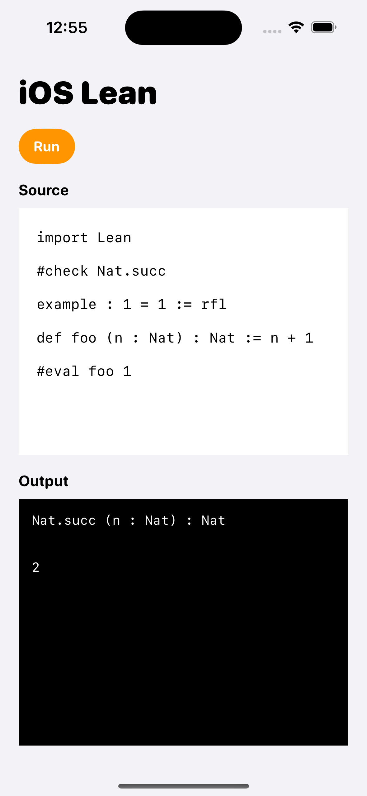
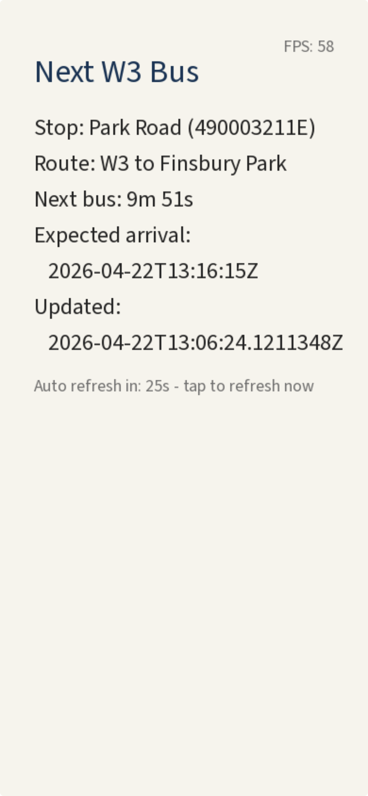
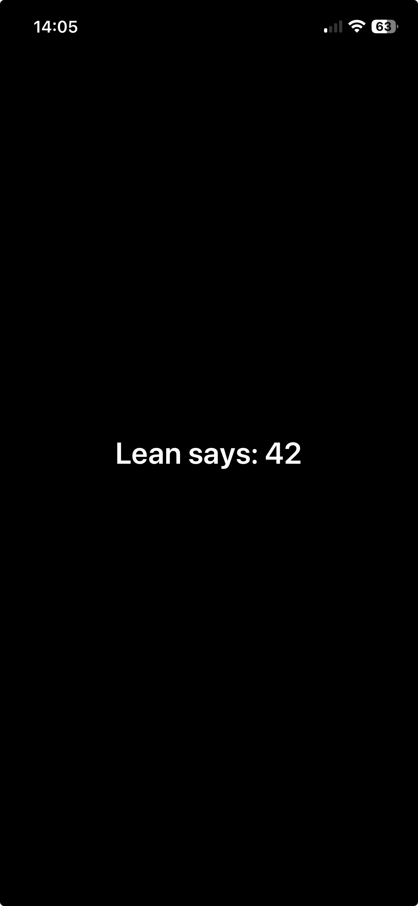

# lean4-ios

This repository ships a modified Lean 4 source tree so that the Lean runtime and
stage0 standard library can be compiled with the iOS toolchain and linked into
native iOS apps.

## Gallery

<table>
  <tr>
    <td width="50%">
      <div align="center">
        <b><a href="examples/flappy">flappy</a></b>
        <br>
        <video src="https://github.com/user-attachments/assets/689caed9-129b-4f28-a1c5-78c1c7b6434f"
           width="240"
           autoplay muted controls></video>
        <br>
        <sub>Flappy Bird clone rendered with SDL.</sub>
      </div>
    </td>
    <td width="50%">
      <div align="center">
        <b><a href="examples/lean-ios-runner">lean-ios-runner</a></b>
        <br>
        
        <br>
        <sub>On-device Lean elaborator / type-checker.</sub>
      </div>
    </td>
  </tr>
  <tr>
    <td width="50%">
      <div align="center">
        <b><a href="examples/sdl-app">sdl-app</a></b>
        <br>
        <video src="https://github.com/user-attachments/assets/7c1a2aa3-0069-45fc-9366-4f9f92c1c0f8"
           width="240"
           autoplay muted controls></video>
        <br>
        <sub>SDL iOS app with animated 2D graphics.</sub>
      </div>
    </td>
    <td width="50%">
      <div align="center">
        <b><a href="examples/bus-times">bus-times</a></b>
        <br>
        
        <br>
        <sub>Live TfL bus arrivals fetched over HTTP, rendered with SDL.</sub>
      </div>
    </td>
  </tr>
  <tr>
    <td width="50%">
      <div align="center">
        <b><a href="examples/app">app</a></b>
        <br>
        
        <br>
        <sub>Minimal Swift iOS app calling a Lean function via a C bridge.</sub>
      </div>
    </td>
    <td></td>
  </tr>
</table>

## Dependencies

1. Clone the repo including submodules (`lean4`, SDL, SDL_ttf, and resvg live
   as submodules under `lean4/` and `third-party/`):

   ```
   git clone --recursive https://github.com/paulcadman/lean-ios.git
   ```

   Or, if you already cloned without `--recursive`:

   ```
   git submodule update --init --recursive
   ```

2. Install [Xcode](https://developer.apple.com/xcode/).

3. Install the Xcode command line tools:

   ```
   xcode-select --install
   ```

4. Install [Homebrew](https://brew.sh/), then install the build dependencies:

   ```
   brew install cmake zstd
   ```

5. Install [Rust](https://rustup.rs/) (the SDL-based examples link against
   `resvg`, which is built from source):

   ```
   curl --proto '=https' --tlsv1.2 -sSf https://sh.rustup.rs | sh
   ```

   Then add the iOS targets:

   ```
   rustup target add aarch64-apple-ios-sim aarch64-apple-ios
   ```

## Building for physical device

Each example has a `Makefile.device` target that codesigns and installs the app
on a connected iOS device. Invoke it with `make -f Makefile.device
run-device-app` and set the following environment variables:

- `DEVICE_ID` — the device UDID or name (as shown by `xcrun devicectl list devices`).
- `DEVICE_CODESIGN_IDENTITY` — the codesigning identity to use (e.g. `Apple
  Development: Your Name (TEAMID)`, as shown by `security find-identity -v -p
  codesigning`).
- `DEVICE_PROVISION_PROFILE` — path to a `.mobileprovision` file whose bundle
  identifier matches the example's `APP_BUNDLE_ID` (or `SDL_APP_BUNDLE_ID`).

## Architecture

See [docs/architecture.md](docs/architecture.md) for an overview of the
project structure and build dependencies.
